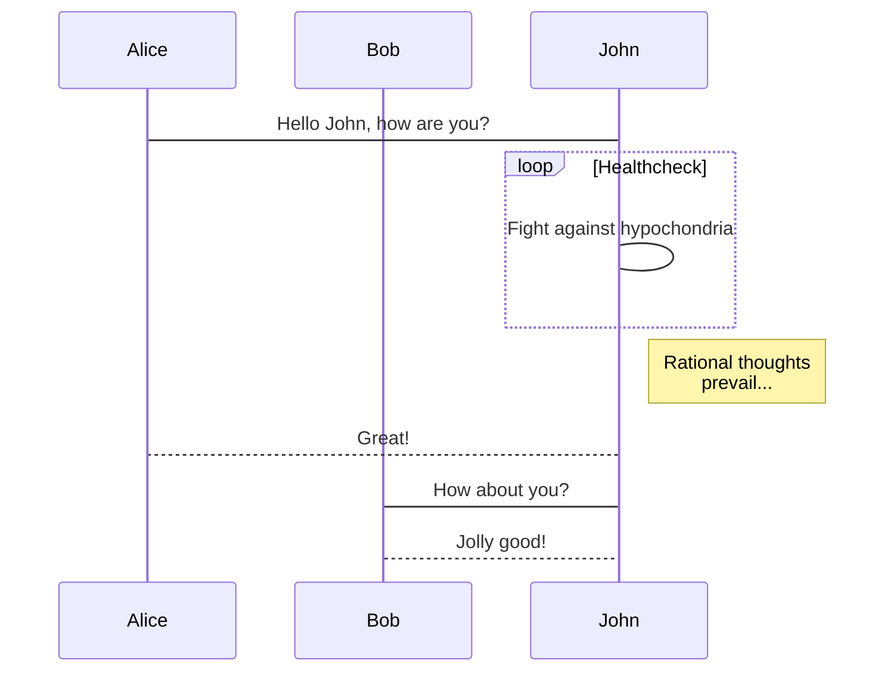

## 背景
此次项目的的特殊性：
1. 项目需部署在B服务器上
2. 请求入口为 A 服务器绑定的域名目录（weixin.domain.com/spring）
3. B 服务器要部署3个应用
 - H5 活动网站
 - 活动管理系统、API服务
 - 二维码生成服务

## 背景

** 这是我司2019春节前期间接到的一个项目，它的主要业务描述与业务目标如下：**

## 业务描述

1、活动主题：老娘舅新春集福·享好礼。

2、活动流程：AR扫描米饭 — 集齐“福”&领取券 — 满“福”领取礼品券 — 礼品券去到门店核销，领取礼品。

3、活动入口：公众号菜单入口（引导更多人关注老娘舅公众号）。

4、活动形式：利用AR扫描的新奇体验方式，引导用户参与，通过礼品兑换及用券消费等形式引导更多顾客前往门店。

5、集福方式：将“福”字拆开为：“礻”、“一”、“口”、“田”四个部分的字，AR扫描获取各个部分字，最后组成一个完整的“福”字即为集满福。

6、集福控制：需要控制各部分字的获取概率，并控制在门店扫描获取到“田”的概率更大。

7、发券控制：根据规则创建券，并设置券的发放概率。

8、礼品码获取：当集满福后，可提交兑换预约，生成兑换码。

9、礼品兑换：获取到礼品兑换码后，前往对应门店，展示兑换码。

10、礼品发放：门店核销礼品兑换码后，发放礼品，核销审核可兑换时间、可兑换门店等信息。
## 业务目标

1、通过活动参与，吸纳更多新会员

2、调动更多老会员活跃参与

3、发券引导提升会员消费活跃度

4、社交分享传播扩大品牌露出曝光度

时间周期：15工作日内上线
## 规划
我们去研发一个业务需求时，首要考虑的是用户如何去使用，在哪里使用。

因为在本项目开展正式研发期间，首先我们要确认我们的运维部署环境、终端用户场景、需要的软硬件资源规划。

这个项目的运维环境较为复杂，我们来逐步复盘一下：
根据客户的需求，我们需要研发的应用有两个

- H5 活动应用
- 活动管理系统
  
资源需求整理

| 编号  | 名称         | 名称            | 路径                            | 用途                           | 开放端口 | 请求地址                   | 运行方式       |
| :---: | :----------- | :-------------- | :------------------------------ | :----------------------------- | :------: | -------------------------- | -------------- |
|   1   | 云服务器 ECS        | Docker          | /usr/bin/docker/etc/docker      | 应用容器引擎                   |   ——   | weixin.chinauff.com/spring | 系统启动       |
|   2   | 云数据库 MySQL | traefik         | /usr/local/spring-service       | 容器及应用反向代理             |    80    | weixin.chinauff.com/spring | docker         |
|   3   | 对象存储 OBS  | spring/qrcode   | /usr/local/spring-qrcode-server | 二维码生成服务                 |   ——   | spring.chinauff.com/qrcode | docker-compose |
|   4   | 百度 AI 图像识别  | H5 春节活动应用 | /usr/local/spring-h5            | 春节活动前端应用               |   ——   | weixin.chinauff.com/spring | pm2            |
|   5   | Application  | Admin Server    | /usr/local/spring-server        | 管理系统 、API服务             |   ——   | sping.chinauff.com         | pm2            |
|   6   | Docker image | 静态文件服务    | /usr/local/spring.static        | 前后端所用到的静态文件资源服务 |   ——   | spring.chinauff.com/static | docker-compose |

1、终端用户使用场景
活动入口：公众号菜单入口
项目的入口位于客户的公众号菜单，要求可获取微信授权并创建活动账户
2、运维部署环境

背景
由于公众号的验证机制，客户的微信授权地址为第三方的一套会员管理系统，而我们只能拿到这个地址的子目录，
我们看一下甲方给到我们的活动页面地址
h5应用域名: wx.chinauff.com/spring

wx.chinauff.com 域名部署在A服务器上面，我们的系统需要部署在 B服务器上，

| 编号  | 类别         | 名称            | 路径                            | 用途                           | 开放端口 | 请求地址                   | 运行方式       |
| :---: | :----------- | :-------------- | :------------------------------ | :----------------------------- | :------: | -------------------------- | -------------- |
|   1   | 软件         | Docker          | /usr/bin/docker/etc/docker      | 应用容器引擎                   |   ——   | weixin.chinauff.com/spring | 系统启动       |
|   2   | Docker Image | traefik         | /usr/local/spring-service       | 容器及应用反向代理             |    80    | weixin.chinauff.com/spring | docker         |
|   3   | Docker Image | spring/qrcode   | /usr/local/spring-qrcode-server | 二维码生成服务                 |   ——   | spring.chinauff.com/qrcode | docker-compose |
|   4   | Application  | H5 春节活动应用 | /usr/local/spring-h5            | 春节活动前端应用               |   ——   | weixin.chinauff.com/spring | pm2            |
|   5   | Application  | Admin Server    | /usr/local/spring-server        | 管理系统 、API服务             |   ——   | sping.chinauff.com         | pm2            |
|   6   | Docker image | 静态文件服务    | /usr/local/spring.static        | 前后端所用到的静态文件资源服务 |   ——   | spring.chinauff.com/static | docker-compose |

甲方的部署环境要求：
1、

## 技术选型
技术选型的标准：
1、技术掌握度
2、需求满足度
3、性能
这个项目在前端方面有几个难点
1、数据变化多
2、交互效果多
3、动画要求高，且动画比较大
4、屏幕适配

从这几个角度分析，我们的技术需要同时满足以上的条件
如果用我们常规H5技术，针对每个页面进行层处理，单独写组件渲染（参考我们18周年庆活动），会存在数据与dom大量交互的问题，
在性能与交互上很难权衡。因此我们考虑选用 mvvm 相关的框架，由于我们前端已经做了一部分静态页面代码，最容易结合的就是 VUE框架，
但此项目是面向大量的前端用户，如果是 spa 模式初始加载时会很影响用户体验，除项目的基础 js、css、image 等文件还有大量的动画
文件要同时加载，是非常耗时的。因为我们需要首屏到达时间短，整体性能要有常规静态页面的体验。这样我们可以复用 vue ssr 技术，而 nuxt.js 
正式 vue 生态中的 vue ssr 的一个良好实现。因此我们最终前端技术框架选型为 nuxt.js。

在使用 nuxt.js 的过程中